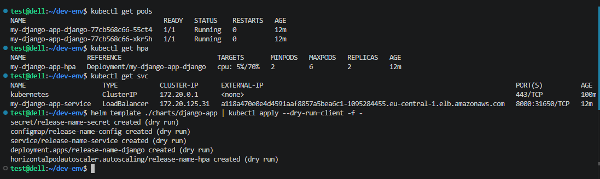

# Terraform AWS Infrastructure & Django App Deployment

Цей проєкт автоматизує розгортання базової інфраструктури в AWS за допомогою Terraform та розгортання Django-застосунку за допомогою Helm.

## 📂 Структура проєкту
Проєкт організований за принципом модульності та розділений на логічні частини:

    .
    ├── bootstrap/                              # Розгортання базової інфраструктури (S3 Backend)
    │   ├── main.tf                             # Основний файл для розгортання S3-бакета
    │   ├── outputs.tf                          # Вивід ARN та назви S3-бакета
    │   ├── terraform.tfvars.example            # Приклад конфігурації змінних для bootstrap
    │   └── variables.tf                        # Оголошення змінних для bootstrap
    │
    ├── charts/django-app/                      # Helm-чарт для розгортання застосунку в Kubernetes
    │   ├── Chart.yaml                          # Метадані чарту (версія, назва, опис)
    │   ├── values.yaml                         # Значення за замовчуванням (образ, репліки, HPA, конфіги)
    │   └── templates/                          # Шаблони Kubernetes маніфестів
    │       ├── configmap.yaml                  # Маніфест для ConfigMap (змінні середовища БД)
    │       ├── deployment.yaml                 # Маніфест Deployment для запуску подів
    │       ├── hpa.yaml                        # Маніфест HorizontalPodAutoscaler (автомасштабування)
    │       ├── secret.yaml                     # Маніфест Secret для паролів
    │       └── service.yaml                    # Маніфест Service (LoadBalancer)
    │
    ├── django/                                 # Вихідний код та налаштування Django-застосунку
    │   ├── Dockerfile                          # Інструкції для створення Docker-образу (Python 3.10)
    │   ├── manage.py                           # Утиліта управління Django
    │   ├── requirements.txt                    # Залежності Python (Django==4.2, psycopg2-binary==2.9.7)
    │   └── goit/                               # Головний пакет застосунку
    │       ├── __init__.py                     # Ініціалізація пакета
    │       ├── asgi.py                         # ASGI-конфігурація
    │       ├── settings.py                     # Налаштування Django
    │       ├── urls.py                         # Маршрутизація URL-адрес
    │       └── wsgi.py                         # WSGI-конфігурація
    │
    ├── modules/                                # Terraform модулі для створення ресурсів AWS
    │   ├── ecr/                                # Модуль Elastic Container Registry
    │   │   ├── ecr.tf                          # Створення репозиторію, політик доступу та Lifecycle Rule
    │   │   ├── outputs.tf                      # Вивід URL, ARN та назви репозиторію
    │   │   └── variables.tf                    # Вхідні змінні для ECR
    │   │
    │   ├── eks/                                # Модуль Elastic Kubernetes Service
    │   │   ├── eks.tf                          # Створення Control Plane кластера та IAM-ролі
    │   │   ├── node.tf                         # Створення групи робочих вузлів (Node Group) та IAM-ролі
    │   │   ├── outputs.tf                      # Вивід Endpoint, назви кластера та ролі
    │   │   └── variables.tf                    # Вхідні змінні для EKS (розмір, інстанси, підмережі)
    │   │
    │   ├── s3-backend/                         # Модуль S3 для збереження стейту (використовується в bootstrap)
    │   │   ├── outputs.tf                      # Вивід даних S3-бакета
    │   │   ├── s3.tf                           # Створення бакета з блокуванням доступу та шифруванням
    │   │   └── variables.tf                    # Вхідні змінні для S3
    │   │
    │   └── vpc/                                # Модуль віртуальної мережі (Virtual Private Cloud)
    │       ├── outputs.tf                      # Вивід ID мереж, IP-адреси NAT тощо
    │       ├── routes.tf                       # Таблиці маршрутизації для публічних та приватних підмереж
    │       ├── variables.tf                    # Вхідні змінні для VPC
    │       └── vpc.tf                          # Створення VPC, підмереж, IGW та NAT Gateway
    │
    ├── .gitignore                              # Файли та папки, що ігноруються Git (наприклад, .terraform, *.tfstate)
    ├── backend.tf                              # Налаштування зберігання стейту Terraform в S3
    ├── main.tf                                 # Основний конфігураційний файл, що викликає всі модулі
    ├── outputs.tf                              # Глобальний файл з вихідними даними інфраструктури (VPC, ECR, EKS)
    ├── README.md                               # Документація проєкту
    ├── terraform.tfvars.example                # Приклад файлу змінних (шаблон)
    ├── variables.tf                            # Глобальні оголошення змінних інфраструктури
    └── versions.tf                             # Вимоги до версій Terraform та AWS Provider


## 🏗️ Архітектура

* **Infrastructure (Terraform):** Створення VPC, EKS кластера та ECR репозиторію.
* **Containerization:** Docker-образ Django-застосунку.
* **Management (Helm):** Розгортання застосунку в кластері з використанням:
    * **Deployment:** Запуск подів з образу ECR.
    * **Service:** LoadBalancer для зовнішнього доступу.
    * **ConfigMap:** Перенесення змінних середовища.
    * **HPA:** Автомасштабування (2-6 подів) при навантаженні > 70%.
    * **Health Checks:** Liveness та Readiness проби для безперервного контролю стану застосунку (кастомний ендпоінт `/health/`).


## 🚀 Інструкція з розгортання

### Крок 0: Розгортання Backend (S3)

Виконується один раз для створення бакета стейтів:

```bash
cd bootstrap
terraform init
terraform apply -auto-approve
cd ..
```

### Крок 1: Розгортання інфраструктури

```bash
terraform init
terraform apply -auto-approve
```

### 2. Завантаження образу в ECR
Використовуйте отриманий `ecr_repository_url` для відправки Docker-образу (замініть `[ACCOUNT_ID]` на свій):

```bash
aws ecr get-login-password --region eu-central-1 | docker login --username AWS --password-stdin [ACCOUNT_ID].dkr.ecr.eu-central-1.amazonaws.com

docker build -t my-django-app:1.0.0 ./django

docker tag my-django-app:1.0.0 [ACCOUNT_ID].dkr.ecr.eu-central-1.amazonaws.com/demo-ecr:1.0.0

docker push [ACCOUNT_ID].dkr.ecr.eu-central-1.amazonaws.com/demo-ecr:1.0.0
```

### 3. Деплой застосунку (Helm)

* Налаштуйте `kubectl` для кластера `eks-cluster-demo` у регіоні `eu-central-1`:

```bash
aws eks update-kubeconfig --region eu-central-1 --name eks-cluster-demo
```

* Встановіть Metrics Server для коректної роботи автоскейлера:

```bash
kubectl apply -f https://github.com/kubernetes-sigs/metrics-server/releases/latest/download/components.yaml
```

* Розгорніть застосунок:
```bash
helm upgrade --install my-django-app ./charts/django-app \
  --set secrets.POSTGRES_PASSWORD="YourSecretPassword" \
  --set secrets.SECRET_KEY="YourSecretDjangoKey"
```


## 📸 Результати роботи




## 🧹 Очищення ресурсів

Щоб уникнути зайвих витрат в AWS, після завершення тестування обов'язково видаліть ресурси:

1. Видаліть реліз Helm: `helm uninstall my-django-app`.


2. Знищте інфраструктуру Terraform: `terraform destroy -auto-approve`.
